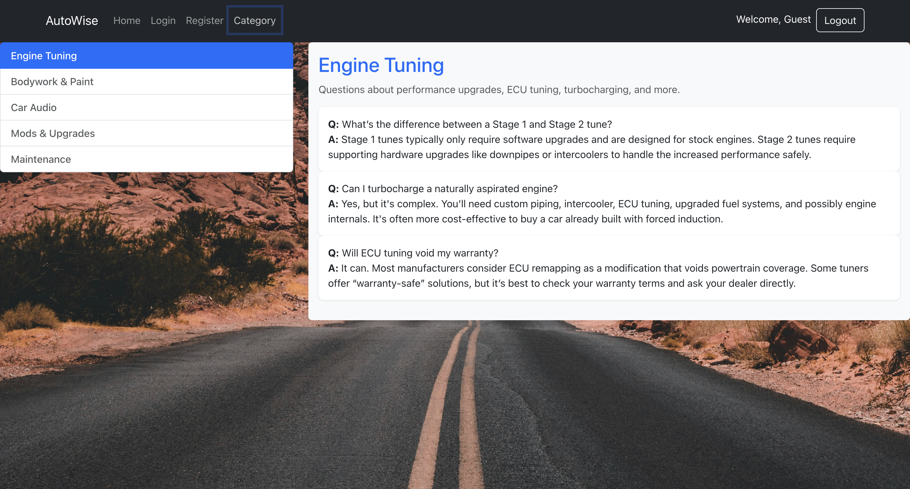

# project4-LoginReg

## Description
The objective is to create a secure, user-friendly app that helps you register, log in, and access personalized content with ease. Manage your questions and explore categories seamlessly—all in one place.

## Screen Shot

### Main/Home page 

### Login Page

### Register Page

### Catogory Page

## Technology used
    * React, React Router
    * Axios
    * JavaScript
    * MySQL
    * Node.js
    * Bootstrap
    * HTML
    * CSS

## About AutoWise app
    The Autowise App is a straightforward tool designed to manage user authentication with ease. Whether you’re creating a new account or logging into an existing one, this application offers a smooth and reliable experience.

    With features focused on usability and security, you’ll be able to:
    * Register and log in quickly and safely
    * Browse content organized by categories

This app provides a clean, user-friendly interface to help users access personalized content with confidence.

## User Story
- Story 1
   As a user, I want to log in with my credentials and remain signed in until I log out, So that I can seamlessly access my dashboard and personalized content without re-entering my information.

- Story 2
    As a user, I want to browse through different automotive categories, So that I can easily find relevant guides, tools, and resources.

- Story 3
    As a user on a mobile device, I want to access all features and content easily on a small screen, So that I can use the app on-the-go without losing functionality.
    

## Wireframe

### Main/Home page

### Login Page

### Register Page

### Catogory Page

## Next Steps
* I would allow users to submit questions tied to specific categories and display those questions on the category pages or on a dashboard for easy browsing.

* I would create a profile page where users can update their username, password, or other info securely.
 
* I would add a commenting or reply system so users can discuss questions and provide feedback.

## Author
Joshua Pierson: <a href="https://www.linkedin.com/in/joshua-pierson726" rel="nofollow">@Linkedin</a>
